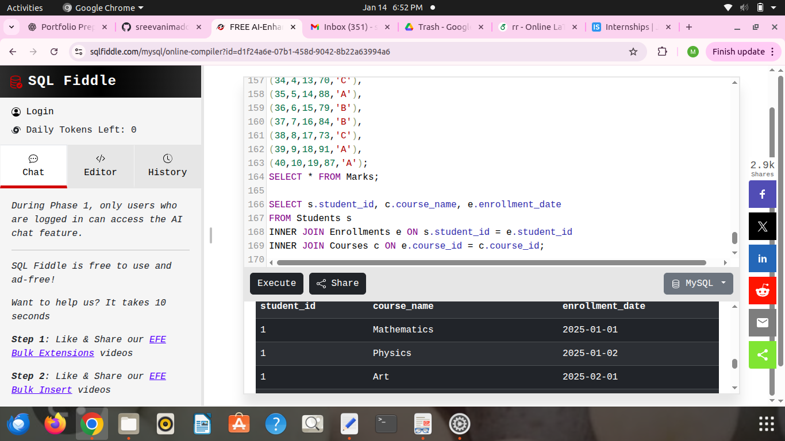
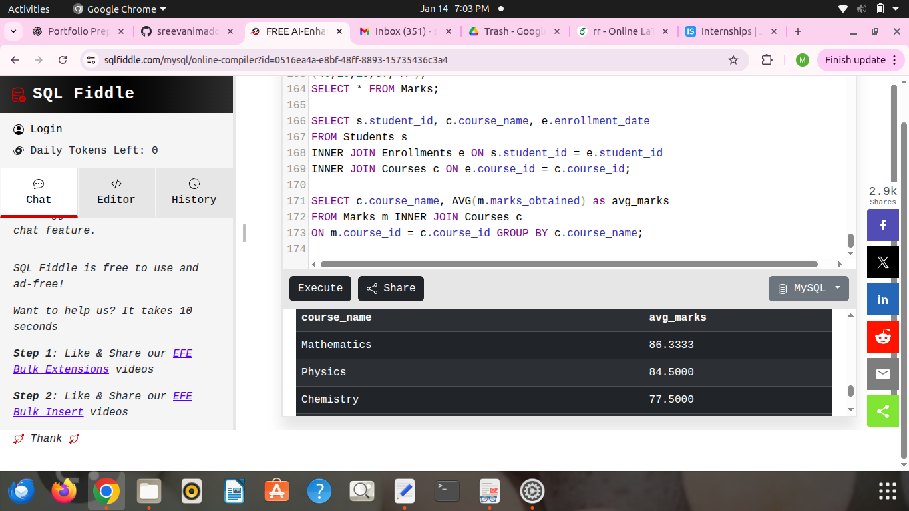
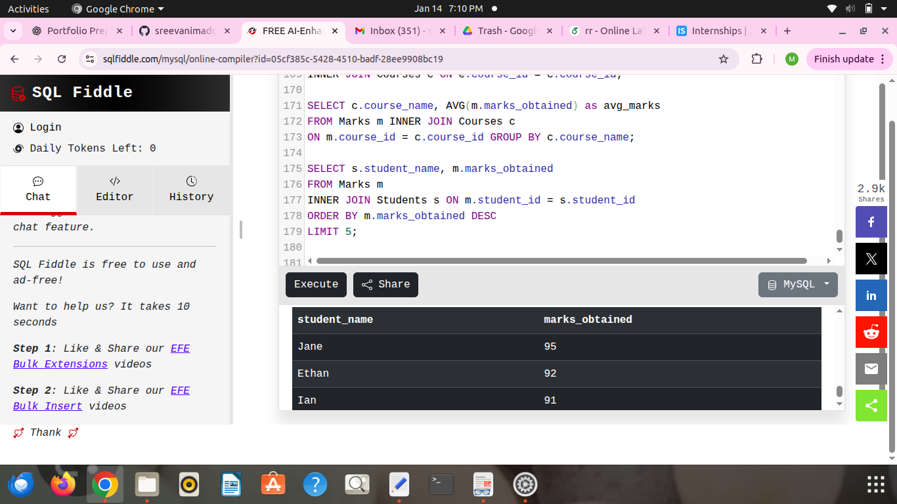
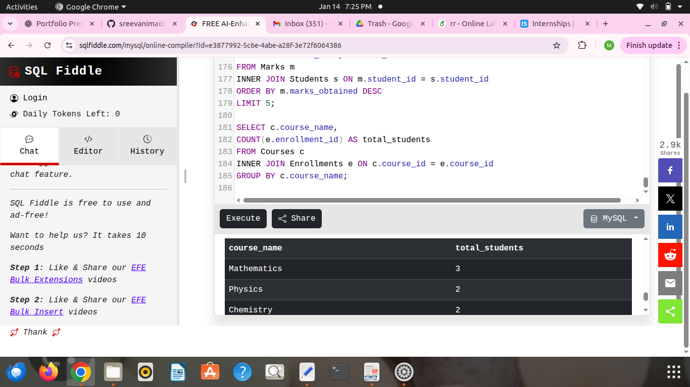
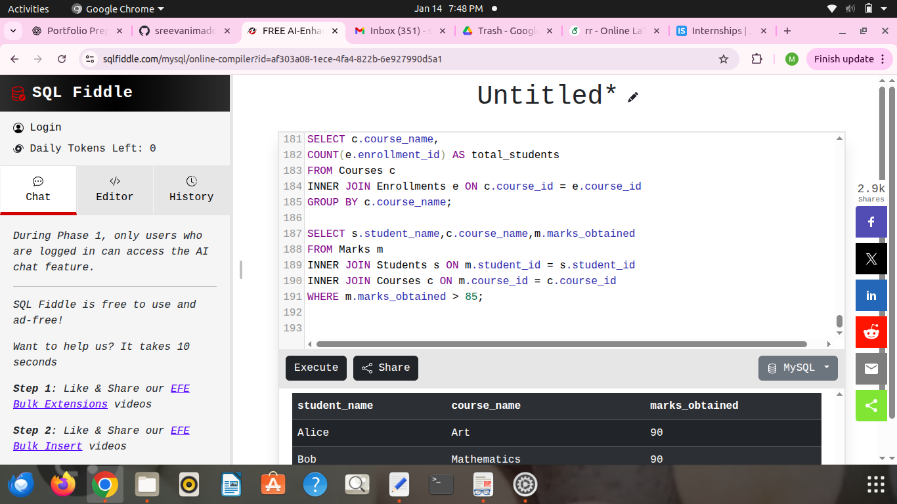

# SQL Query Output Screenshots

## Query 1: All Students
.png)
.png)

## Query 2: All Courses
.png)
.png)

## Query 3: All Enrollments
.png)
.png)

## Query 4: All Markss
.png)
.png)

## Query 5: All Enrollments

## Query 6: All Enrollments

## Query 7: All Enrollments

## Query 8: All Enrollments

## Query 9: All Enrollments

